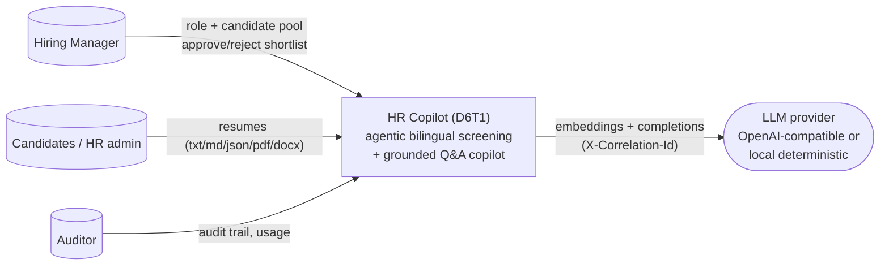
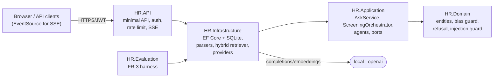
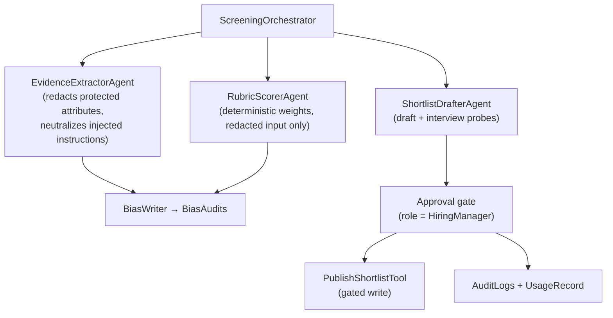
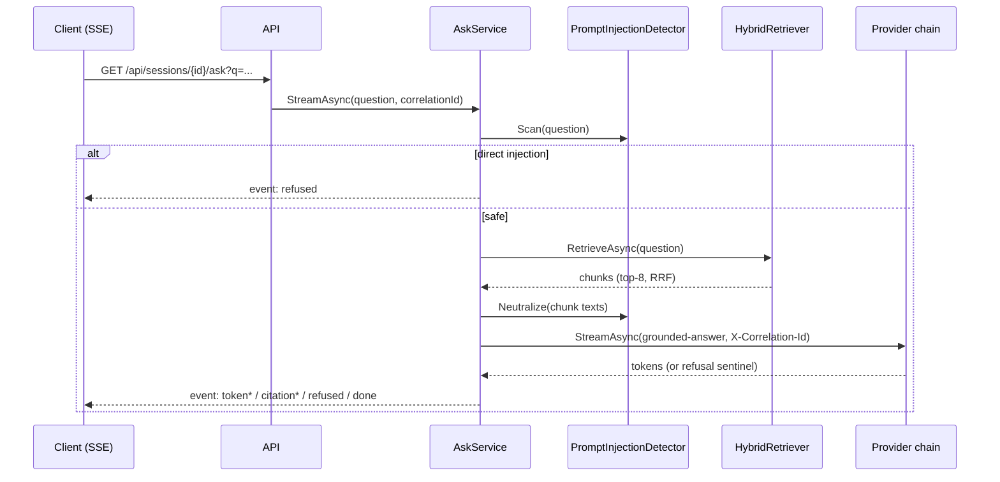
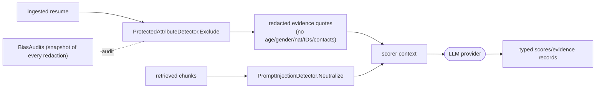

# Architecture

**Variant:** D6T1 · **Status:** MVP implemented, evaluated and packaged (v1.0.0) · updated 2026-09-18

## Layer dependency rule (enforced by `Directory.Build.props` warnaserror + review)

```
HR.Domain ──────────────> (nothing; entities, value objects, errors, pure logic)
HR.Application ─────────> HR.Domain        (ports as interfaces, agents, workflows)
HR.Infrastructure ──────> HR.Application   (all SDK adapters + composition root)
HR.API ────────────────> HR.Infrastructure (+Application/Domain transitively)
```

Acceptance grep: no `HttpClient`/web-framework/DB/SDK types in `HR.Domain` or
`HR.Application`.

## C4 L1 — System context



## C4 L2 — Containers



## C4 L3 — Primary components (screening flow)



## Sequence diagram — grounded Q&A (R-6)



## Data-flow diagram — what the LLM provider sees (trust boundaries)



The provider never sees the raw intake: protected attributes are cut before
tokenization, embedded instructions are neutralised before formatting, and the
approved shortlist is re-validated deterministically (`ValidateShortlistTool`)
before it can be published.

## ER diagram (core persistence)

```mermaid
erDiagram
    DOCUMENTS ||--o{ DOCUMENT_CHUNKS : "has"
    DOCUMENTS ||--o{ RUNS : "ingests"
    SESSIONS ||--o{ SESSION_MESSAGES : "contains"
    RUNS ||--o{ RUN_EVENTS : "emits"
    RUNS ||--o{ USAGE_RECORDS : "counts"
    RUNS ||--o{ APPROVAL_REQUESTS : "requires"
    RUNS ||--o{ BIAS_AUDITS : "records"
    DOCUMENTS { guid id }
    DOCUMENT_CHUNKS { guid id; float[] embedding }
    SESSIONS { guid id; string owner_user_id }
    RUNS { guid id; int kind; int status; string correlation_id }
```

## Architectural decision records

- `docs/adr/0001-clean-architecture.md` — strict port-and-adapter layering.
- `docs/adr/0002-chunking.md` — structure-aware chunking.
- `docs/adr/0003-vector-store.md` — vector store behind a port (pgvector deferred).
- `docs/adr/0004-bilingual-retrieval.md` — bilingual query expansion + RRF fusion.
- `docs/adr/0005-orchestration-pattern.md` — explicit staged pipeline + approval gate.